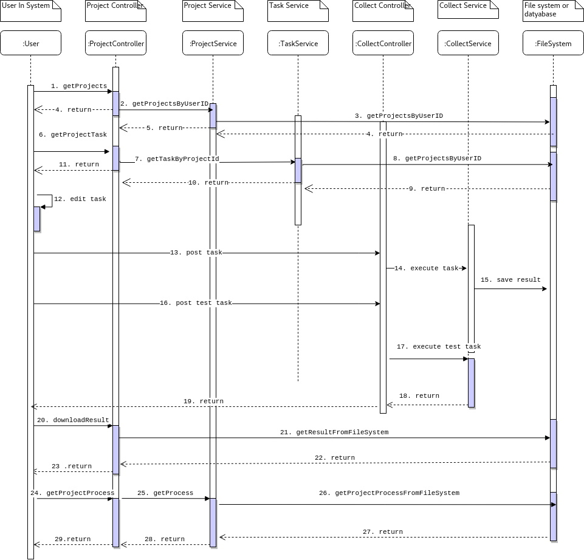
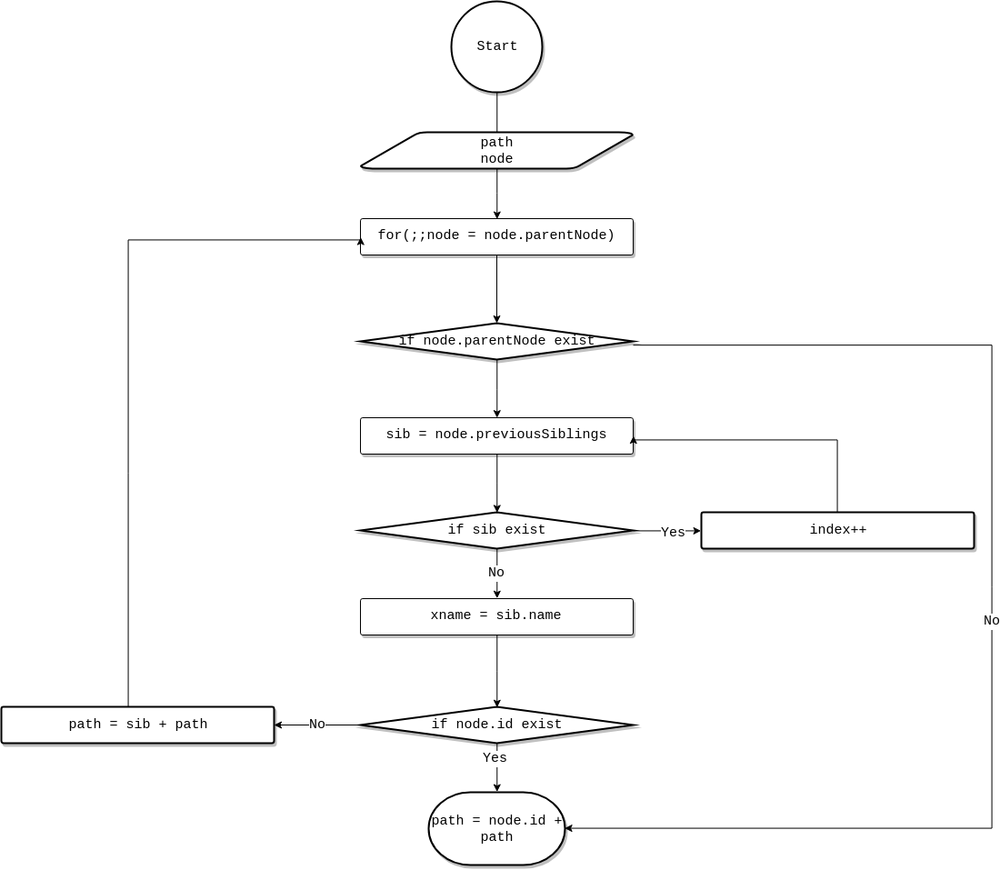
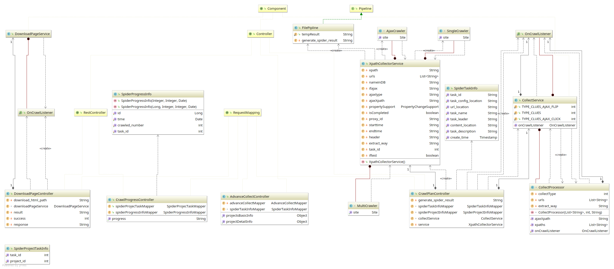

# Detailed Design

## Process Flow Design



## Algorithm Design

### Get the XPath of the element

- background

  XPath stands for XML Path Language. It uses a non-XML syntax to provide a flexible way of addressing (pointing to) different parts of an [XML](https://developer.mozilla.org/en-US/docs/XML) document. When crawling a web page, the element is located mainly through XPath and the content of the element is extracted. According to the existing web page, by clicking on the element on the web page to get the XPath of the element, you can crawl the content of the web page through the XPath.The algorithm traverses document through the elements' parentNode and previousSibling until it finds the elements that have ID and splits into a complete XPath

- algorithm framework (flowchart of pseudo code)

  

- dataset

  Input document's element

- key steps

  - Traverses document through the elements' parentNode and previousSibling until it finds the elements that have ID, otherwise, *html/body* can be used as a root tag. Finale them become into a complete XPath

- code

  ```
  $shadow.domXpath = function(dom) {
      dom = $(dom).get(0);
      var path = "";
      var currentTagName = "";
      var isExistId = false;
      for (; dom && dom.nodeType == 1; dom = dom.parentNode) {
          var index = 1;
          for (var sib = dom.previousSibling; sib; sib = sib.previousSibling) {
              if (sib.nodeType == 1 && sib.tagName == dom.tagName) {
                  index++;
              }
          }
          currentTagName = dom.tagName.toLowerCase();
          // check whether id is exist
          if (dom.id) {
              currentTagName = "//*[@id=\"" + dom.id + "\"]";
              isExistId = true;
              break;
          } else {
              if (index > 0)
                  currentTagName += "[" + index + "]";
          }
          path = "/" + currentTagName + path;
      }
      if (isExistId) {
          path = currentTagName + path;
      }
      path = path.replace("html[1]/body[1]/","html/body/");
      return path;
  };

  ```

  ​

## Class Design



---

### SpiderTaskInfo

*com.monetware.model.collect*

public class **SpiderTaskInfo**

The spider task info instance in the system.

#### Fields

| Modifier and Type | Field                | Description                              |
| ----------------- | -------------------- | ---------------------------------------- |
| private String    | task_id              | the task id                              |
| private String    | task_name            | the task name                            |
| private String    | task_leader          | the task leader information              |
| private String    | task_description     | the task description                     |
| private String    | task_config_location | the task configuration location in local |
| private String    | url_location         | the task url location in local           |
| private String    | content_location     | the task result content location in local |
| private Timestamp | create_time          | the task create time                     |

#### Methods

**Getter and Setter**

This class is Java bean

### SpiderProjectTaskInfo

*com.monetware.model.collect*

public class **SpiderProjectTaskInfo**

The relational between project and task in the system.

#### Fields

| Modifier and Type | Field      | Description    |
| ----------------- | ---------- | -------------- |
| private int       | project_id | the project id |
| private int       | task_id    | the task id    |

#### Methods

**Getter and Setter**

This class is Java bean

### SpiderProgressInfo

com.monetware.model.collect*

public class **SpiderProjectTaskInfo**

The spider Progress info instance in the system.

#### Fields

| Modifier and Type | Field          | Description           |
| ----------------- | -------------- | --------------------- |
| private Long      | id             | the progress id       |
| private Integer   | task_id        | the task id           |
| private Integer   | crawled_number | the number of crawled |
| private Date      | time           | the time of crawled   |

#### Methods

**Getter and Setter**

This class is Java bean


### DownloadPageService

*com.monetware.service.collect*

public class **DownloadPageService**

The Download Page Service instance in the system.

#### Methods

> crawl

*public void crawl(OnCrawlListener onCrawlListener, String url)*

Download page.

**returns**

void

**parameters**

- OnCrawlListener *onCrawlListener* : the listener of downloading
- String *url* : the url of website

> replaceAll

*public static String replaceAll(String urlPath, String xml)*

Replace src and script tag content.

**returns**

the string of xml data

**parameters**

- String *urlPath* : the source address of website
- String *xml* : the xml data of website

---
### OnCrawlListener

*com.monetware.service.collect*

the interface of  downloading listener

#### Methods

> onSuccess

void onSuccess(String result)

**parameters**

String *result* : the result of download

> onFail

void onFail(String error)

**parameters**

String *error* : the information of download error

### CollectProcessor

*com.monetware.service.collect*

the collect instance of system

#### Fields
| Modifier and Type       | Field           | Description                |
| ----------------------- | :-------------- | -------------------------- |
| private String          | ajaxXpath       | the xpath of ajax          |
| private List<String>    | xpaths          | crawl content xpaths       |
| private List<String>    | urls            | the url list of crawling   |
| private String          | extract_way     | the way of crawling        |
| private int             | collectType     | the type of collecting     |
| private OnCrawlListener | onCrawlListener | the listener of collecting |

#### Construction

> CollectProcessor(List<String> urls, int collectType, String extract_way)

Create a spider processor

**parameters**

- urls: the path list of collecting
- collectType: the type of collecting
- extract_way: the way of collecting

#### Methods

> start

*public void start()*

Process the page, extract urls to fetch, extract the data and store

**returns**

void

> getContent

*List<String> getContent(HtmlPage page, List<String> xpaths, String extract_way)*

Get content from htmlPage use xpath

**parameters**

- HtmlPage page : the page of html
- List<String> xpaths : the extracted path
- String extract_way : the extracted way

**returns**

the result content

> getNumber

*int getNumber(HtmlPage page, List<String> xpaths)*

Get number of content from one htmlpage

**parameters**

- HtmlPage page : the page of html
- List<String> xpaths : the extracted path

**returns**

the number of page

> getXpathListTag

*String getXpathListTag(List<String> xpaths)*

Get the root tag according to xpaths

**parameters**

- List<String> xpaths : the extracted path

**returns**

the xpath of root tag 

> getAbsUrl

*public static String getAbsUrl(String absolutePath, String relativePath)*

Get the absolute url

**parameters**

- String basePath : the base url
- String relativePath : the relative url

**returns**

the absolute url

> isAjaxHtml

*public boolean isAjaxHtml(HtmlPage page, String xpath)*

Check if the page is using ajax

**parameters**

- HtmlPage page : the page of html
- String xpath : the xpath of page

**returns**

the boolean value if using ajax

### CollectService

*com.monetware.service.collect*

public class **CollectService**

The Collect Service instance in the system.

#### Fields

| Modifier and Type       | Field                 | Description                |
| ----------------------- | --------------------- | -------------------------- |
| public static int       | TYPE_CLUES_AJAX_FLIP  | clues ajax type            |
| public static int       | TYPE_CLUES            | clues type                 |
| public static int       | TYPE_CLUES_AJAX_CLICK | clues ajax click type      |
| private OnCrawlListener | onCrawlListener       | the listener of collecting |


#### Methods

> crawl

*public void crawl(OnCrawlListener onCrawlListener, List<String> urls, int type, String extract_way, String ajaxXpath, String xpath)*

*public void crawl(OnCrawlListener onCrawlListener, List<String> urls, int type, String extract_way, String ajaxXpath, String xpath1, String xpath2)*

Crawling to the web

**parameters**

- OnCrawlListener *onCrawlListener* : the listener of downloading
- String *url* : the url of website
- int *type* : the type of collecting
- String *extract_way* : the way of crawling 
- String *ajaxXpath* : crawl content xpath if using ajax click
- String *xpath* : crawl content xpath
- String *xpath2* : crawl content xpath if using clues

**returns**

void

> setOnCrawlListener

*public void setOnCrawlListener(OnCrawlListener onCrawlListener)*

Set OnCrawlListener

**parameters**

- OnCrawlListener *onCrawlListener* : the listener of downloading

**returns**

void

> saveToFile

*public void saveToFile(String filename, String content, boolean append)*

Save content to file

**parameters**

- String *filename* : the filename of saved
- String *content* : the content of saved
- boolean *append* : choose file saved way

**returns**

void

> generateUrls

*public List<String> generateUrls(JSONObject jsonObject)*

Generate urls according to url list

**parameters**

- JSONObject *jsonObject* : the json data

**returns**

the list of url

### FilePipline

com.monetware.model.collect

*public class FilePipline implements us.codecraft.webmagic.pipeline.Pipeline*

the pipeline of saving result in the system

| Modifier and Type    | Field                  | Description               |
| -------------------- | ---------------------- | ------------------------- |
| public static String | tempResult             | the temp of result        |
| private String       | generate_spider_result | the path of saved content |

#### Methods

> process

*public void process(ResultItems resultItems, Task task)*

Save result to file

**parameters**

- ResultItems *resultItems* : the result item
- Task task : the crawling task

**returns**

void

### CrawlPlanController

*com.monetware.controller*

public class **CrawlPlanController**

The crawl controller instance in the system.

#### Fields

| Modifier and Type       | Field                   | Description                    |
| ----------------------- | ----------------------- | ------------------------------ |
| private String          | generate_spider_result  | the path of saving             |
| SpiderTaskInfoMapper    | spiderTaskInfoMapper    | the interface of connecting db |
| SpiderProjectInfoMapper | spiderProjectInfoMapper | the interface of connecting db |
| CollectService          | collectService          | the service of collecting      |
| XpathCollectorService   | service                 | the service single crawling    |


#### Methods

> crawl

*public void crawl(@RequestBody JSONObject request)*

Start crawling and save results to local file

**parameters**

- JSONObject *request* : the requests json data

**returns**

the result of crawled

### DownloadPageController

*com.monetware.controller*

public class **DownloadPageController**

The download page controller instance in the system.

#### Fields

| Modifier and Type   | Field                | Description                     |
| ------------------- | -------------------- | ------------------------------- |
| private String      | generate_html_result | the path of saved download page |
| DownloadPageService | downloadPageService  | the service of downloading      |
| private String      | result               | the result                      |
| private int         | success              | the state of downloading        |

#### Methods

> crawl

*public void crawl(@RequestParam("url_path") String url_path)*

Start download web page and save to local

**parameters**

- String *url_path* : the address of the download web page

**returns**

the content of html

> checkFileExist

*public boolean checkFileExist(@RequestParam("filename") String filename)*

Check whether the file exists according to the file name

**parameters**

- String *filename* : the filename

**returns**

the result of file existing

> hashCode

*private String hashCode(String str)*

Get the string-hashcode of the string

**parameters**

- String *str* : the string

**returns**

the hashcode of the string

### CollectController

*com.monetware.controller*

public class **CollectController**

This class be used to crawling test 

#### Fields

| Modifier and Type     | Field          | Description              |
| --------------------- | -------------- | ------------------------ |
| private StringBuilder | res            | the result               |
| CollectService        | collectService | the service of crawling  |
| private int           | success        | the state of downloading |

#### Methods

> crawl

*public void crawl(@RequestParam("data") String data)*

Start download web page and return to front

**parameters**

- String *data* : the config of crawling web page

**returns**

the result of crawling