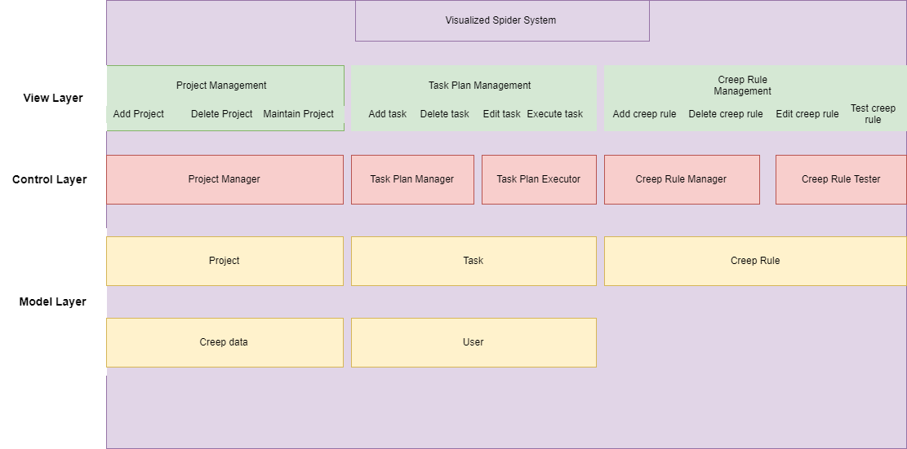
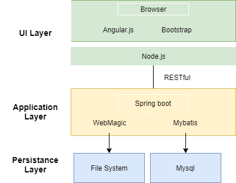
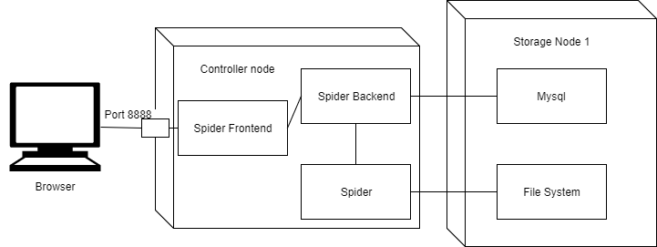
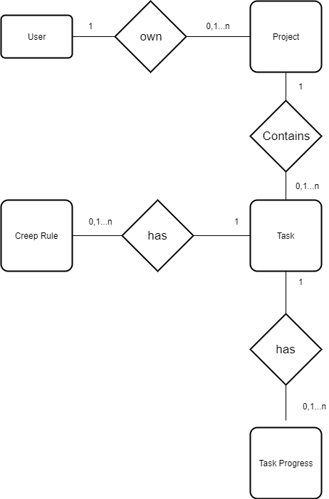

# High-level Design (概要设计规约)

## Prototype Design (原型设计)

Here's the UI design of the project


## Business Architecture (业务架构)

The business architecture outline the key components in each layers of the project systems. Here is the diagram:




## Technology Architecture (技术架构)

The architecture of the technology stacks (coding language, frameworks, libraries, styles, etc) used in the project. Here is the diagram:



## Deployment Topology (部署结构)

Deployment Topology shows how the whole project is deployed in the physical environment, including servers, VMs/containers, networks, key components, etc. A overview picture is required to show the topology. Here is the picture



## Data Models (数据建模)

### Entity-Relation Design (实体-关系设计)

An Entity-Relation Diagram is required to show the concepts in the project and their relations. And for each entity and realtion, there should be a description after the diagram.

 E-R diagram:



### Database Design (数据库设计)

According to the Entity-Realtion Design, the detailed database design for entities and relations should be listed as tables. 

**Table: User**

| Column | Type | Description |
|:---:|:---:|:---|
| id | integer | key, identifier |
| username | vaarchar[64] | username of the user |

**Table: Spider_Project_Info**

| Column | Type | Description |
|:---:|:---:|:---|
| project_id | integer | key, identifier |
| project_name | varchar[255] | name of the project |
| create_time | timestamp | create time of the project |

**Table: Spider_task_Info**

| Column | Type | Description |
|:---:|:---:|:---|
| task_id | integer | key, identifier |
| task_name | varchar[255] | name of the task |
| task_leader | varchar[127] | leader of the task |
| task_description | text | discription of the task |
| task_config_location | varchar[255] | the config file of the task|
| url_location | varchar[255] | the url file of the task|
| content_location | varchar[255] | the content file of the task|
| create_time | varchar[255] | the create time of the task|

**Table: Spider_Project_Task**

| Column | Type | Description |
|:---:|:---:|:---|
| project_id | integer | key, identifier |
| task_id | integer | key,identifier |

**Table: Spider_Progress_Info**

| Column | Type | Description |
|:---:|:---:|:---|
| id | integer | key, identifier |
| task_id | integer | the id of the task |
| crawled_number | integer | the number of the crawled urls |
| time | timestamp | the current time |


## Interface Specifications （接口规约）

The specifications of interfaces used in interactions among subsystems:

---
### *advance/getProjectsBasicInfo*   

#### Description (接口描述)

Get all basic information of a project.

| | |
|-|-|
| Request Method | Get |


#### Parameters (参数)

| Name | Located in | Description | Required | Schema |
|:-:|:-:|:-|:-:|:-|


#### Responses (返回结果)

| Code | Description | Schema |
|:----:|:--------|:--|
| 200 | Successful response | *list* : jsonArray | 

#### Request Sample (示例请求)

```
advance/getProjectsBasicInfo
```

#### Response Sample (示例结果)

```
{

  "arrayList" : [{"project_id":1,"project_name":"123",create_time:2018-01-09 21:21:09}]

}

```
---

---
### *advance/getProjectsDetailInfo*   

#### Description (接口描述)

Get the detailed information of project.

| | |
|-|-|
| Request Method | Get |


#### Parameters (参数)

| Name | Located in | Description | Required | Schema |
|:-:|:-:|:-|:-:|:-|


#### Responses (返回结果)

| Code | Description | Schema |
|:----:|:--------|:--|
| 200 | Successful response | *list* : jsonArray | 

#### Request Sample (示例请求)

```
advance/getProjectsDetailInfo
```

#### Response Sample (示例结果)

```
{

  "responseList" : [{advanceProjectEntity:{"project_id":1,"project_name":"123",create_time:2018-01-09 21:21:09},advanceTaskEntities:[{task_id:1,task_name:"123",create_time:2018-01-09 21:40:09}]}]

}

```
---
---
### *advance/createProject*   

#### Description (接口描述)

Create a Project

| | |
|-|-|
| Request Method | Post |


#### Parameters (参数)

| Name | Located in | Description | Required | Schema |
|:-:|:-:|:-|:-:|:-|
| project_name | query | project name | Yes | string |


#### Responses (返回结果)

| Code | Description | Schema |
|:----:|:--------|:--|
| 200 | Successful response | *code* : boolean <br/> *message* : string <br/> *newProject* : json | 
| 200 | Fail response | *code* : boolean <br/> *message* : string  | 

#### Request Sample (示例请求)

```
advance/createProject
```

#### Response Sample (示例结果)

```
{
  "code" : true,
  "message" : "新建项目成功",
  "newProject" :{advanceProjectEntity:{"project_id":1,"project_name":"123",create_time:2018-01-09 21:21:09},advanceTaskEntities:[{task_id:1,task_name:"123",create_time:2018-01-09 21:40:09}]} 

}

```
---

---
### *advance/createTask*   

#### Description (接口描述)

Create a task

| | |
|-|-|
| Request Method | Post |


#### Parameters (参数)

| Name | Located in | Description | Required | Schema |
|:-:|:-:|:-|:-:|:-|
| project_id | query | project id | Yes | int |
| task_name | query | task name | Yes | string |


#### Responses (返回结果)

| Code | Description | Schema |
|:----:|:--------|:--|
| 200 | Successful response | *code* : boolean <br/> *message* : string <br/> *newTask* : json <br/> *project_id* : int  | 
| 200 | Fail response | *code* : boolean <br/> *message* : string <br/>  | 

#### Request Sample (示例请求)

```
advance/createTask
```

#### Response Sample (示例结果)

```
{
  "code" : true,
  "message" : "新建任务成功",
  "project_id" : 2,
  "newTask" :{task_id:1,task_name:"123",create_time:2018-01-09 21:40:09}

}

```
---
---
### *advance/uploadFile*   

#### Description (接口描述)

upload a file

| | |
|-|-|
| Request Method | Post |


#### Parameters (参数)

| Name | Located in | Description | Required | Schema |
|:-:|:-:|:-|:-:|:-|
| file | query | file to upload | Yes | file |


#### Responses (返回结果)

| Code | Description | Schema |
|:----:|:--------|:--|
| 200 | Successful response | *code* : boolean  | 

#### Request Sample (示例请求)

```
advance/uploadFile
```

#### Response Sample (示例结果)

```
{
  "code" : true,

}

```
---

---
### *advance/task_config*   

#### Description (接口描述)

Change the config of the task

| | |
|-|-|
| Request Method | Post |


#### Parameters (参数)

| Name | Located in | Description | Required | Schema |
|:-:|:-:|:-|:-:|:-|
| config | query | task config | Yes | json |


#### Responses (返回结果)

| Code | Description | Schema |
|:----:|:--------|:--|
| 200 | Successful response | *code* : boolean   | 

#### Request Sample (示例请求)

```
advance/task_config
```

#### Response Sample (示例结果)

```
{
  "code" : true
}

```
---
---
### *advance/task_config*   

#### Description (接口描述)

Get the config of the task

| | |
|-|-|
| Request Method | Get |


#### Parameters (参数)

| Name | Located in | Description | Required | Schema |
|:-:|:-:|:-|:-:|:-|
| task_id | query | task id | Yes | int |


#### Responses (返回结果)

| Code | Description | Schema |
|:----:|:--------|:--|
| 200 | Successful response | *config* : json   | 

#### Request Sample (示例请求)

```
advance/task_config?task_id=24
```

#### Response Sample (示例结果)

```
{
  留空
}

```
---
---
### *collect/crawler*   

#### Description (接口描述)

Collect data with the clue pattern and Ajax flip

| | |
|-|-|
| Request Method | Post |


#### Parameters (参数)

| Name | Located in | Description | Required | Schema |
|:-:|:-:|:-|:-:|:-|
| data | query | the test creep rule of many | Yes | json |


#### Responses (返回结果)

| Code | Description | Schema |
|:----:|:--------|:--|
| 200 | Successful response | *res* : string   | 

#### Request Sample (示例请求)

```
collect/clues
```

#### Response Sample (示例结果)

```
"result"

```
---
---
### *collect/CrawledData*   

#### Description (接口描述)

Collect data with the single pattern and Ajax flip

| | |
|-|-|
| Request Method | Post |


#### Parameters (参数)

| Name | Located in | Description | Required | Schema |
|:-:|:-:|:-|:-:|:-|
| request | query | the creep rule of test | Yes | json |


#### Responses (返回结果)

| Code | Description | Schema |
|:----:|:--------|:--|
| 200 | Successful response | *testResult* : string   | 

#### Request Sample (示例请求)

```
collect/CrawledData
```

#### Response Sample (示例结果)

```
{"testResult":"abc"}

```
---
---
### *CrawlPlan/Plan*   

#### Description (接口描述)

Execute the whole crawl plan task

| | |
|-|-|
| Request Method | Post |


#### Parameters (参数)

| Name | Located in | Description | Required | Schema |
|:-:|:-:|:-|:-:|:-|
| project_id | query | the id of th project | Yes | int |
| task_id | query | the id of th task | Yes | int |


#### Responses (返回结果)

| Code | Description | Schema |
|:----:|:--------|:--|
| 200 | Successful response | *code* : true   | 

#### Request Sample (示例请求)

```
CrawlPlan/Plan
```

#### Response Sample (示例结果)

```
{"code":true}

```
---

---
### *progress/status*   

#### Description (接口描述)

Get the progress of all projects

| | |
|-|-|
| Request Method | Get |


#### Parameters (参数)

| Name | Located in | Description | Required | Schema |
|:-:|:-:|:-|:-:|:-|


#### Responses (返回结果)

| Code | Description | Schema |
|:----:|:--------|:--|
| 200 | Successful response | *result* : jsonArray   | 

#### Request Sample (示例请求)

```
progress/status
```

#### Response Sample (示例结果)

```
{"result":[{"process":1.0,"project_id":1,"crawled_urls":1,"rate":105.43580131208996,"nowtime":"2017-12-25 20:24:53","total_urls":1,"starttime":"2017-12-25 20:24:19","timeprogresspoints":[{"time":"2017-12-25 20:25:00","crawlednumber":1},{"time":"2017-12-25 20:26:00","crawlednumber":1},{"time":"2017-12-25 20:27:00","crawlednumber":1}]}]}

```
---
---
### *collect/download*   

#### Description (接口描述)

Get the download message of the given url

| | |
|-|-|
| Request Method | Get |


#### Parameters (参数)

| Name | Located in | Description | Required | Schema |
|:-:|:-:|:-|:-:|:-|
| url_path | query | the url path | Yes | string |


#### Responses (返回结果)

| Code | Description | Schema |
|:----:|:--------|:--|
| 200 | Successful response | *response* : "success"   | 

#### Request Sample (示例请求)

```
collect/download
```

#### Response Sample (示例结果)

```
{"response":"success"}

```
---
---
### *collect/file/exist*   

#### Description (接口描述)

Get exist message of given file name

| | |
|-|-|
| Request Method | Get |


#### Parameters (参数)

| Name | Located in | Description | Required | Schema |
|:-:|:-:|:-|:-:|:-|
| filename | query | the file name | Yes | string |


#### Responses (返回结果)

| Code | Description | Schema |
|:----:|:--------|:--|
| 200 | Successful response | true   | 

#### Request Sample (示例请求)

```
collect/file/exist
```

#### Response Sample (示例结果)

```
true

```
---